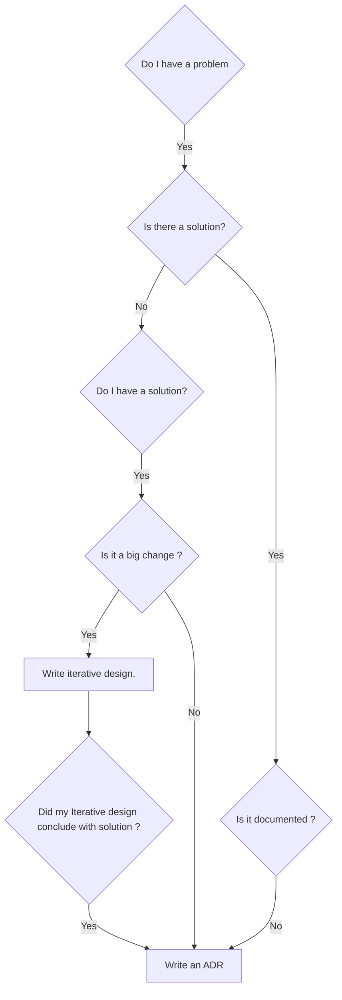

# Architectural Decision Records (ADRs)

[Instructions](./README.md)

## ADRs

* [ADR-20230929 Use ADR](./20230929_use_adr.md) - Use ADR
* [ADR-20230930_use_ansible](./20230930_use_ansible.md) - Use Ansible for provisioning my machine
* [ADR-20230929_use_brew](./20230929_use_brew.md) - Use brew to install software when possible
* [ADR-20230930_use_utm_for_testing](./20230930_use_utm_for_testing.md) - Use UTM for testing

## What is an architecture decision record ?

An architecture decision record (ADR) is a document that captures an architectural decision made along with its context and consequences.

An architecture decision (AD) is a software design choice.

## How to start using ADRs

To start using ADRs, talk with your teammates about these areas.

Decision identification:

* How urgent and how important is the AD?

* Does it have to be made now, or can it wait until more is known?

* Both personal and collective experience, as well as recognized design methods and practices, can assist with decision identification.

* Ideally maintain a decision todo list that complements the product todo list.

Decision making:

* A number of decision making techniques exists, both general ones and software architecture specific ones, for instance, dialogue mapping.

* Group decision making is an active research topic.

Decision enactment and enforcement:

* ADs are used in software design; hence they have to be communicated to, and accepted by, the stakeholders of the system that fund, develop, and operate it.

* Architecturally evident coding styles and code reviews that focus on architectural concerns and decisions are two related practices.

* ADs also have to be (re-)considered when modernizing a software system in software evolution.

Decision sharing (optional):

* Many ADs recur across projects.

* Hence, experiences with past decisions, both good and bad, can be valuable reusable assets when employing an explicit knowledge management strategy.

* Group decision making is an active research topic.

Decision documentation:

* Architecture decision record pull request is accepted with status accepted.

## ADR file name conventions

We use markdown format for the ADRs.

We prefer to use a file name convention that has a specific format.

Examples:

* 20201201_choose_database.md

* 20201201_format_timestamps.md

* 20201201_manage_passwords.md

* 20201201_handle_exceptions.md

Our file name convention:

* Datetime in ``YYYYMMDD`` pattern. *Rationale: helps in deducing which ADRs supersede previous ADRs. Filesystem timestamps can change due to clerical changes in the contents.*

* The name has a present tense imperative verb phrase. This helps readability and matches our commit message format.

* The name uses lowercase and underscores (same as this repo). This is a balance of readability and system usability.

* The extension is markdown, ``md``.

## Suggestions for writing good ADRs

Characteristics of a good ADR:

* Point in Time - Identify when the AD was made

* Rationality - Explain the reason for making the particular AD

* Immutable record - The decisions made in a previously published ADR should not be altered

* Specificity - Each ADR should be about a single AD

Characteristics of a good context in an ADR:

* Explain your organization's situation and business priorities

* Include rationale and considerations based on social and skills makeups of your teams

Characteristics of good Consequences in an ADR::

* Right approach - "We need to start doing X instead of Y"

* Wrong approach - Do not explain the AD in terms of "Pros" and "Cons" of having made the particular AD
* Technical dept made in decision is clearly pointed out.

A new ADR may take the place of a previous ADR:

* When an AD is made that replaces or invalidates a previous ADR, a new ADR should be created

## When should I write ADR

### Backfilling decisions

Sometimes a decision was made, or an implicit standard forms naturally on its own, but because it was never documented, it’s not clear to everyone  that this decision exists. One way to identify an undocumented decision is during Peer Review. The introduction of a competing code pattern or library could lead the reviewer to discover an undocumented decision. Below is my mental model for when to backfill an architecture decision:

1. Do I have a problem? **Yes**
2. Is there solution? **Yes**
3. Is it documented? **No**
4. **Write an ADR!**

#### Proposing large changes

Over the lifecycle of a repository, you will have to make decisions that have a large impact on how it is designed, maintained, extended, and more. As requirements evolve, you may need to introduce a breaking change to your system, which would require a migration from your consumers. We have iterative design , architecture reviews,to facilitate agreements on an approach or implementation. When these processes run their course, how should we capture the decisions made? Below is my mental model for how to document these large changes:

1. Do I have a problem? **Yes**
2. Is there a blessed solution? **No**
3. Do I have a solution? **Yes**
4. Is it a big change? **Yes**
5. **Write an Iterative design !**
6. Did my Iterative design conclude with a solution? **Yes**
7. **Write an ADR!**

### Proposing small/no changes

In our day-to-day, we make small decisions that have little to no impact. The cost of undocumented decisions is hard to measure, but the effects usually include duplicated efforts (other engineers try to solve the same problems) or competing solutions (two third-party libraries that do the same thing). Enough small decisions can compound into a future problem that requires a large process or effort (ie. migration). Documenting these decisions doesn’t have to cost much. ADRs can be lightweight. Below is my mental model for working through this:

1. Do I have a problem? **Yes**
2. Is there a blessed solution? **No**
3. Do I have a solution? **Yes**
4. Is it a big change? **No**
5. **Write an ADR!**

### Decision tree in  diagram



## Template we use for ADR

We use the ADR template by Michael Nygard

This is the template in [Documenting architecture decisions - Michael Nygard](http://thinkrelevance.com/blog/2011/11/15/documenting-architecture-decisions).

```markdown

# Title

## Status

What is the status, such as proposed, accepted, rejected, deprecated, superseded, etc.?

## Context

What is the issue that we're seeing that is motivating this decision or change?

## Decision

What is the change that we're proposing and/or doing?

## Consequences

What becomes easier or more difficult to do because of this change?
```

## Superseding

When a new decision is made it will supersede the old one. State of old one is changed to superseded.
The name of file superseding is added to the old ADR as link. The old ADR is not touched in other aspects.

New ADR is written for new design choice.